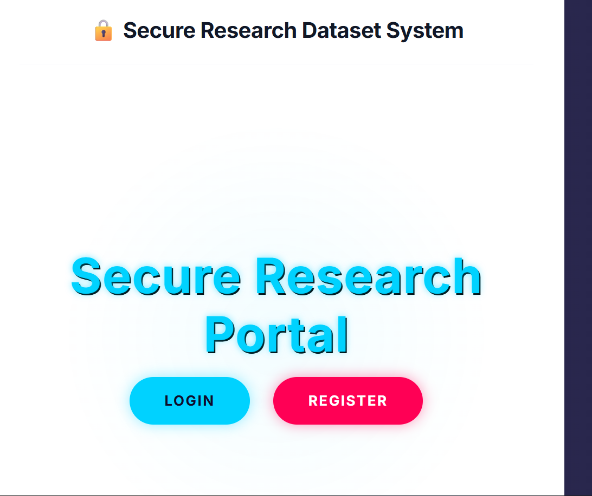
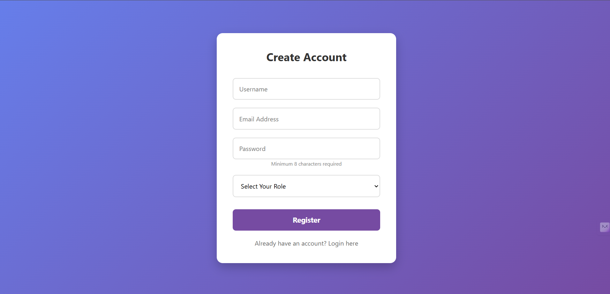
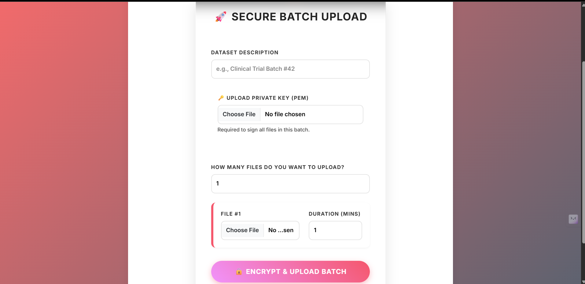
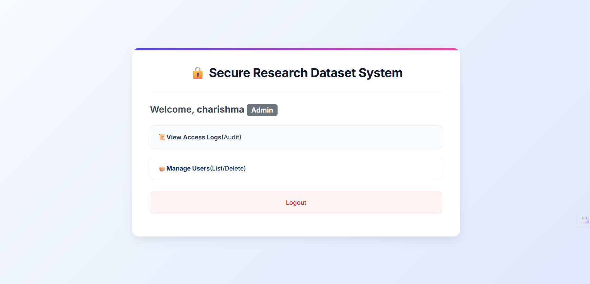

🔐 Secure Research Dataset Sharing System (Production Backend Project)
📌 Project Overview

The Secure Research Dataset Sharing System is a production-level web platform designed to securely share sensitive research datasets with controlled and time-limited access.

The system ensures data confidentiality, integrity, and authorized usage using multi-layer authentication, role-based access control, and hybrid encryption (AES + RSA). It allows researchers to upload encrypted datasets, enables authorized users to access them within a defined time period, and protects data using secure authentication and verification mechanisms.

This platform is ideal for academic institutions, research organizations, and secure data-sharing environments where privacy and controlled access are critical.

🎯 Objectives

Implement secure dataset sharing with controlled access.

Ensure data confidentiality using hybrid encryption.

Provide role-based access control for different users.

Enable time-limited dataset availability.

Implement strong authentication and authorization mechanisms.

Maintain dataset integrity using digital signatures.

⚙️ Technologies Used

Python

Flask (Backend Framework)

HTML, CSS, JavaScript

MongoDB (Database)

JWT Authentication

AES Encryption (Data Security)

RSA Encryption (Key Exchange)

SHA-256 Hashing (Password Security)

Docker (Containerization)

Redis (Caching)

AWS S3 / MinIO (Cloud Storage)

SMTP Email Verification

🔑 Key Features
🔐 Secure Authentication

JWT-based authentication

Email OTP verification

Multi-layer login security

Token-based session management

👥 Role-Based Access Control

Admin → manages users and system logs

Researcher → uploads and shares datasets

Reviewer → accesses shared datasets

🛡️ Hybrid Encryption Security

AES encryption for dataset files

RSA encryption for secure key exchange

End-to-end data protection

🔑 Password Protection

SHA-256 hashing with salt

Secure credential storage

Protection against password theft

✍️ Digital Signature Verification

Ensures dataset authenticity

Prevents tampering or modification

Validates data integrity

⏳ Time-Limited Dataset Access

Datasets accessible only within defined time period

Automatic expiration of access

Controlled data usage

☁️ Secure Cloud Storage

Dataset storage using AWS S3 / MinIO

Secure file upload and download

Encrypted storage access

🚀 Production-Level Backend Architecture

REST API architecture

Docker containerization

Redis caching

Rate limiting and brute-force protection

Secure API endpoints

📡 API Integration

Backend REST APIs

Secure dataset upload and sharing

Role-based API authorization

🖥️ System Architecture
Client → JWT Authentication → Flask API → Redis Cache → MongoDB → Secure Storage (S3/MinIO)
▶️ How to Run the Project
1️⃣ Install dependencies
pip install -r requirements.txt
2️⃣ Configure environment variables

Create .env file and add required credentials.

3️⃣ Run the server
python app.py
4️⃣ Open in browser
http://127.0.0.1:5000

## 📸 Example Input

--- 

📊 Project Highlights (Resume Value)

Production-level backend architecture

JWT authentication system

Hybrid encryption implementation

Secure dataset sharing platform

Role-based authorization design

Cloud storage integration

Security-focused system design

👨‍💻 Author

Hemanth Gudi
Computer Science Student | Full Stack Developer | Backend Engineer
